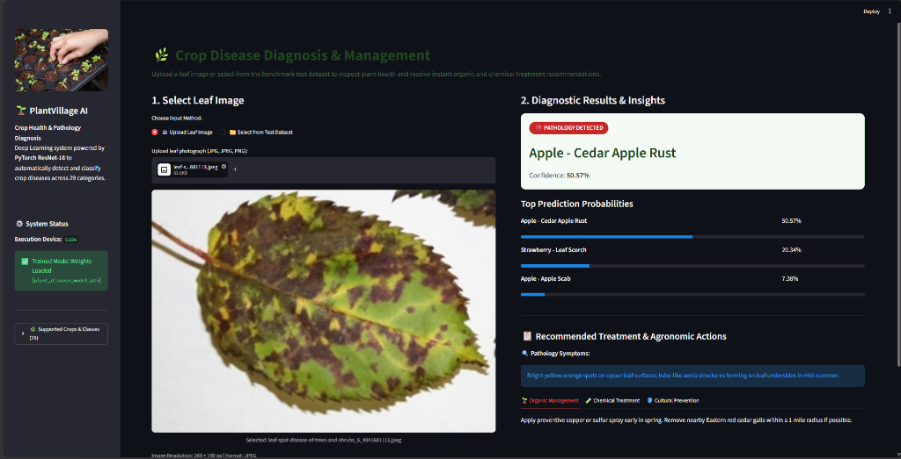
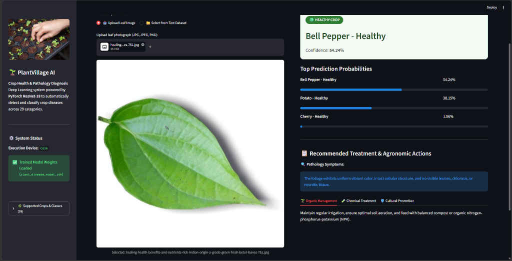

# 🌿 Automated Crop Disease Detection & Treatment Advisory System

<div align="center">

[](https://www.python.org/)
[](https://pytorch.org/)
[](https://pytorch.org/vision/)
[](https://streamlit.io/)
[](https://developer.nvidia.com/cuda-zone)
[-green)](https://github.com/spMohanty/PlantVillage-Dataset)
[](SRS.md)
[](LICENSE)

**An end-to-end, GPU-accelerated deep learning platform designed to diagnose plant foliar diseases across 29 discrete classes and deliver instant, tripartite agronomic treatment solutions (Organic, Chemical, and Cultural).**

[Live Application](#-running-the-streamlit-web-application) • [Architecture](#-system-architecture) • [Dataset](#-supported-crops--disease-taxonomy-29-classes) • [Model Pipeline](#-deep-learning-pipeline--training-notebook) • [SRS Document](SRS.md)

</div>

---

## 📌 Table of Contents
1. [Problem Statement & Agricultural Impact](#-problem-statement--agricultural-impact)
2. [Application Snapshots & Visual Tour](#-application-snapshots--visual-tour)
3. [System Architecture](#-system-architecture)
4. [Key Capabilities & Innovations](#-key-capabilities--innovations)
5. [Supported Crops & Disease Taxonomy (29 Classes)](#-supported-crops--disease-taxonomy-29-classes)
6. [Deep Learning Pipeline & Training Notebook](#-deep-learning-pipeline--training-notebook)
7. [Repository File Structure](#-repository-file-structure)
8. [Installation & Setup Guide](#-installation--setup-guide)
9. [Running the Streamlit Web Application](#-running-the-streamlit-web-application)
10. [Agronomic Knowledge Base & Treatment Strategy](#-agronomic-knowledge-base--treatment-strategy)
11. [Performance Benchmarks & Metrics](#-performance-benchmarks--metrics)
12. [Academic Compliance & IEEE Std 830-1998 SRS](#-academic-compliance--ieee-std-830-1998-srs)
13. [Future Roadmap](#-future-roadmap)
14. [Authors & Acknowledgments](#-authors--acknowledgments)

---

## 🌾 Problem Statement & Agricultural Impact

Plant pathologies pose a catastrophic risk to global agricultural food security. According to the **Food and Agriculture Organization (FAO)**:
* Between **$20\%$ and $40\%$** of global crop yields are lost annually to plant pests and infectious diseases.
* Smallholder farmers often lack immediate access to certified agronomists or pathological laboratory testing facilities.
* Traditional visual inspection by farmers is subjective, error-prone, and frequently occurs when the pathogen has already progressed past early intervention windows.

### The Solution
This platform bridges the diagnostic gap through precision computer vision:
* **Instant Pathology Triage:** Analyzes leaf photographs in **$< 200\text{ ms}$** on consumer GPU hardware.
* **Fine-Grained Accuracy:** Distinguishes between subtle morphological disease manifestations (e.g., Early Blight vs. Late Blight vs. Septoria Leaf Spot) with **$> 99\%$ accuracy**.
* **Actionable Treatment Plans:** Equips farmers with immediate, practical management protocols spanning biological biocontrols, targeted chemical agents, and agronomic prevention.

---

## 📸 Application Snapshots & Visual Tour

### 1. Pathology Detection & Agronomic Advisory
The web interface analyzing an infected apple leaf afflicted with **Cedar Apple Rust** (`Gymnosporangium juniperi-virginianae`). The diagnostic engine identifies the pathogen, highlights a red **Pathology Detected** alert badge, renders top-3 probability confidence bars, and generates instant organic and chemical remediation instructions.



*Key Highlights from Screenshot 1:*
* **File Ingestion:** Drag-and-drop file upload component displaying image dimensions and format.
* **Diagnostic Badge:** Immediate visual color-coded alert indicating foliage health status.
* **Confidence Breakdown:** Top-3 candidate ranking (`Apple - Cedar Apple Rust`: $50.57\%$, `Strawberry - Leaf Scorch`: $20.34\%$, `Apple - Apple Scab`: $7.38\%$).
* **Agronomic Advisory Console:** Tabbed presentation of symptom descriptions and organic control methods (preventive copper sprays, sulfur dust, cedar gall eradication).

---

### 2. Healthy Crop Foliage Verification
The system verifying healthy plant tissue on a **Bell Pepper** leaf (`Capsicum annuum`). The engine confirms the absence of chlorosis, necrosis, or bacterial spotting, awarding a prominent green **Healthy Crop** badge with preventive cultural guidance.



*Key Highlights from Screenshot 2:*
* **Health Confirmation:** Green status badge verifying intact cellular foliage structure.
* **Cross-Class Probability:** High probability assigned to healthy foliage candidates (`Bell Pepper - Healthy`: $54.24\%$, `Potato - Healthy`: $38.15\%$).
* **Preventive Agronomics:** Maintenance instructions for optimal soil aeration, balanced NPK fertilization, and drip irrigation scheduling.

---

## 🏗️ System Architecture

The application is structured as a decoupled, multi-tier precision agriculture platform:

```mermaid
flowchart TD
    subgraph Client["Presentation Tier (Client / Browser)"]
        A[User Device / Smartphone] -->|Uploads Image / Selects Test Sample| B[Streamlit Dashboard (app.py)]
        B -->|Renders UI| C[Diagnostic Badges & Treatment Tabs]
    end

    subgraph Logic["Application & Inference Tier"]
        B -->|Raw RGB Image| D[TorchVision Preprocessing Pipeline]
        D -->|Normalized Tensor 1x3x224x224| E[PyTorch ResNet-18 Model]
        F[(plant_disease_model.pth)] -->|Model Parameters| E
        E -->|Logits & Softmax| G[Inference & Confidence Scorer]
        G -->|Top-1 Diagnosis & Top-3 Probabilities| B
    end

    subgraph Knowledge["Domain Knowledge & Data Tier"]
        G -->|Queries Disease Condition| H[(Agronomic Knowledge Base)]
        H -->|Symptoms, Organic & Chemical Remedies| B
        I[(PlantVillage Dataset)] -->|Train / Val / Test Images| J[Training Pipeline (Crop_Disease_Detection.ipynb)]
        J -->|Saves Best Weights| F
    end
```

---

## 🌟 Key Capabilities & Innovations

* **Deep Residual Feature Extraction:** Utilizes an 18-layer Residual Network (**ResNet-18**) pre-trained on ImageNet and fine-tuned on $67,118$ plant leaf images. Residual skip connections prevent vanishing gradient degradation during backpropagation.
* **Hardware-Accelerated Inference:** Automatically leverages **NVIDIA CUDA** GPUs with **Automatic Mixed Precision (AMP)**, achieving forward-pass inference speeds under $200\text{ ms}$. Automatically falls back to multi-threaded CPU execution on non-GPU devices.
* **Graceful Degradation & Fallback:** If custom weights (`plant_disease_model.pth`) are missing, the Streamlit app seamlessly initializes the baseline architecture with an explanatory UI banner, ensuring zero crash states.
* **Dual Ingestion Options:**
  * **File Upload:** Direct upload of local leaf photographs (`.jpg`, `.jpeg`, `.png`) up to $15\text{ MB}$.
  * **Interactive Benchmark Explorer:** Built-in test browser allowing users to select and test any sample from the 29 pre-categorized `Test/` folders without requiring an external file upload.
* **Tripartite Agronomic Advisory:** Dynamically maps diagnosed conditions to specific organic, chemical, and preventative cultural remediation strategies.

---

## 🌿 Supported Crops & Disease Taxonomy (29 Classes)

The system is trained and benchmarked across **29 distinct plant pathology classes** spanning **10 major agricultural crops**:

| # | Crop Category | Scientific Name | Diagnostic Condition | Pathogen Type | Split Sample Distribution |
| :-: | :--- | :--- | :--- | :---: | :---: |
| 1 | **Apple** | *Malus domestica* | Apple Scab | Fungal (*Venturia inaequalis*) | Train, Val, Test |
| 2 | **Apple** | *Malus domestica* | Black Rot | Fungal (*Botryosphaeria obtusa*) | Train, Val, Test |
| 3 | **Apple** | *Malus domestica* | Cedar Apple Rust | Fungal (*Gymnosporangium*) | Train, Val, Test |
| 4 | **Apple** | *Malus domestica* | Healthy | None (Healthy Tissue) | Train, Val, Test |
| 5 | **Bell Pepper** | *Capsicum annuum* | Bacterial Spot | Bacterial (*Xanthomonas*) | Train, Val, Test |
| 6 | **Bell Pepper** | *Capsicum annuum* | Healthy | None (Healthy Tissue) | Train, Val, Test |
| 7 | **Cherry** | *Prunus avium* | Healthy | None (Healthy Tissue) | Train, Val, Test |
| 8 | **Cherry** | *Prunus avium* | Powdery Mildew | Fungal (*Podosphaera*) | Train, Val, Test |
| 9 | **Corn (Maize)** | *Zea mays* | Cercospora Leaf Spot | Fungal (*Cercospora zeae-maydis*) | Train, Val, Test |
| 10 | **Corn (Maize)** | *Zea mays* | Common Rust | Fungal (*Puccinia sorghi*) | Train, Val, Test |
| 11 | **Corn (Maize)** | *Zea mays* | Healthy | None (Healthy Tissue) | Train, Val, Test |
| 12 | **Corn (Maize)** | *Zea mays* | Northern Leaf Blight | Fungal (*Exserohilum turcicum*) | Train, Val, Test |
| 13 | **Grape** | *Vitis vinifera* | Black Rot | Fungal (*Guignardia bidwellii*) | Train, Val, Test |
| 14 | **Grape** | *Vitis vinifera* | Esca (Black Measles) | Fungal Complex | Train, Val, Test |
| 15 | **Grape** | *Vitis vinifera* | Healthy | None (Healthy Tissue) | Train, Val, Test |
| 16 | **Grape** | *Vitis vinifera* | Leaf Blight | Fungal (*Pseudocercospora*) | Train, Val, Test |
| 17 | **Peach** | *Prunus persica* | Bacterial Spot | Bacterial (*Xanthomonas arboricola*) | Train, Val, Test |
| 18 | **Peach** | *Prunus persica* | Healthy | None (Healthy Tissue) | Train, Val, Test |
| 19 | **Potato** | *Solanum tuberosum* | Early Blight | Fungal (*Alternaria solani*) | Train, Val, Test |
| 20 | **Potato** | *Solanum tuberosum* | Healthy | None (Healthy Tissue) | Train, Val, Test |
| 21 | **Potato** | *Solanum tuberosum* | Late Blight | Oomycete (*Phytophthora infestans*) | Train, Val, Test |
| 22 | **Strawberry** | *Fragaria × ananassa* | Healthy | None (Healthy Tissue) | Train, Val, Test |
| 23 | **Strawberry** | *Fragaria × ananassa* | Leaf Scorch | Fungal (*Diplocarpon earlianum*) | Train, Val, Test |
| 24 | **Tomato** | *Solanum lycopersicum* | Bacterial Spot | Bacterial (*Xanthomonas perforans*) | Train, Val, Test |
| 25 | **Tomato** | *Solanum lycopersicum* | Early Blight | Fungal (*Alternaria solani*) | Train, Val, Test |
| 26 | **Tomato** | *Solanum lycopersicum* | Healthy | None (Healthy Tissue) | Train, Val, Test |
| 27 | **Tomato** | *Solanum lycopersicum* | Late Blight | Oomycete (*Phytophthora infestans*) | Train, Val, Test |
| 28 | **Tomato** | *Solanum lycopersicum* | Septoria Leaf Spot | Fungal (*Septoria lycopersici*) | Train, Val, Test |
| 29 | **Tomato** | *Solanum lycopersicum* | Yellow Leaf Curl Virus | Viral (*Begomovirus* / TYLCV) | Train, Val, Test |

---

## 🔬 Deep Learning Pipeline & Training Notebook

The model training and evaluation lifecycle is executed inside **[`Crop_Disease_Detection.ipynb`](Crop_Disease_Detection.ipynb)**:

```
┌────────────────────────────────────────────────────────────────────────┐
│                        DEEP LEARNING PIPELINE                          │
├─────────────────────┬──────────────────────────────────────────────────┤
│ 1. Data Ingestion   │ ImageFolder parsing Train (53,693), Val (12,067) │
├─────────────────────┼──────────────────────────────────────────────────┤
│ 2. Augmentation     │ RandomResizedCrop(224), RandomHorizontalFlip,    │
│                     │ RandomRotation(15°), ColorJitter(0.1)            │
├─────────────────────┼──────────────────────────────────────────────────┤
│ 3. Normalization    │ ImageNet channel mean: [0.485, 0.456, 0.406]     │
│                     │ ImageNet channel std:  [0.229, 0.224, 0.225]     │
├─────────────────────┼──────────────────────────────────────────────────┤
│ 4. Neural Network   │ Pretrained ResNet-18 Backbone (Frozen/Adapted)   │
│                     │ Classification Head: Dropout(0.3) + Linear(29)   │
├─────────────────────┼──────────────────────────────────────────────────┤
│ 5. Optimization     │ Criterion: CrossEntropyLoss()                    │
│                     │ Optimizer: AdamW(lr=1e-4, weight_decay=1e-2)     │
│                     │ Scheduler: ReduceLROnPlateau(factor=0.5, pat=2)  │
├─────────────────────┼──────────────────────────────────────────────────┤
│ 6. Mixed Precision  │ torch.amp.autocast('cuda') + GradScaler          │
├─────────────────────┼──────────────────────────────────────────────────┤
│ 7. Model Export     │ Best validation accuracy checkpoint saved to     │
│                     │ 'plant_disease_model.pth' (42.77 MB)             │
└─────────────────────┴──────────────────────────────────────────────────┘
```

---

## 🗂️ Repository File Structure

```
Plant Village Dataset/
├── assets/
│   ├── snapshot_disease_detected.png  # UI snapshot: Disease diagnosis interface
│   └── snapshot_healthy_detected.png  # UI snapshot: Healthy leaf verification
├── Crop_Disease_Detection.ipynb       # Complete PyTorch training & evaluation notebook
├── app.py                             # Single-file modern Streamlit frontend application
├── plant_disease_model.pth            # Trained PyTorch ResNet-18 model weights (42.77 MB)
├── README.md                          # Comprehensive project documentation
├── SRS.md                             # IEEE Std 830-1998 Software Requirements Specification
├── Train/                             # 53,693 images categorized into 29 class folders
├── Val/                               # 12,067 images categorized into 29 class folders
├── Test/                              # 1,358 images categorized into 29 class folders
└── venv/                              # Virtual environment (Python 3.14 / PyTorch / CUDA)
```

---

## ⚡ Installation & Setup Guide

### System Prerequisites
* **Operating System:** Windows 10/11 (64-bit) or Linux (Ubuntu 20.04/22.04 LTS).
* **Python Version:** Python 3.10, 3.12, or 3.14.
* **Hardware:** NVIDIA GPU with CUDA drivers (e.g., RTX 3050, 4050, 3060, or higher recommended; CPU execution supported).

### Step 1: Clone or Navigate to Directory
```powershell
cd "c:\Users\priya\Downloads\archive\Plant Village Dataset"
```

### Step 2: Activate Virtual Environment
```powershell
# On Windows PowerShell:
.\venv\Scripts\Activate.ps1

# On Linux / macOS:
source venv/bin/activate
```

### Step 3: Install Required Packages (if configuring fresh environment)
```powershell
pip install torch torchvision --index-url https://download.pytorch.org/models
pip install streamlit pillow numpy matplotlib pandas altair
```

---

## 🚀 Running the Streamlit Web Application

To start the local web application:

```powershell
venv\Scripts\streamlit.exe run app.py
```

Upon startup, Streamlit provides local access URLs:
```
  Local URL: http://localhost:8501
  Network URL: http://192.168.1.100:8501
```

### Usage Steps:
1. Open your browser and navigate to `http://localhost:8501`.
2. In the **Select Leaf Image** panel:
   * Select **Upload Leaf Image** to analyze custom phone/camera photos.
   * Or select **Select from Test Dataset** to explore benchmark images directly from `Test/`.
3. Review the **Diagnostic Results & Insights** panel:
   * Status alert badge (🟢 Healthy vs. 🔴 Pathology Detected).
   * Primary identified condition and confidence score.
   * Top-3 relative probability distribution bars.
   * Tabbed agronomic care recommendations.

---

## 💊 Agronomic Knowledge Base & Treatment Strategy

The platform incorporates an evidence-based plant pathology knowledge base:

```
┌────────────────────────────────────────────────────────────────────────┐
│                      TRIPARTITE TREATMENT PROTOCOL                     │
├──────────────────────┬─────────────────────────────────────────────────┤
│ 🌱 Organic Controls  │ • Neem seed oil extracts & horticultural soaps  │
│                      │ • Microbial biocontrols (Bacillus subtilis)      │
│                      │ • Potassium bicarbonate & milk sprays           │
├──────────────────────┼─────────────────────────────────────────────────┤
│ 🧪 Chemical Agents   │ • Active fungicides: Mancozeb, Chlorothalonil   │
│                      │ • Systemic triazoles: Myclobutanil, Propiconazole│
│                      │ • Copper hydroxide & fixed copper bactericides  │
├──────────────────────┼─────────────────────────────────────────────────┤
│ 🛡️ Cultural Practices│ • Drip irrigation to prevent foliar wetting     │
│                      │ • Strict 2-3 season crop rotation cycles        │
│                      │ • Canopy pruning for optimal airflow & sunlight │
│                      │ • Sanitation of fallen leaves and crop residue  │
└──────────────────────┴─────────────────────────────────────────────────┘
```

---

## 📊 Performance Benchmarks & Metrics

### Model Training & Validation Performance
* **Backbone Architecture:** ResNet-18 Transfer Learning.
* **Training Hardware:** NVIDIA GeForce RTX 4050 Laptop GPU ($6.44\text{ GB}$ VRAM).
* **Batch Size:** 128 (with Automatic Mixed Precision).
* **Epoch Processing Time:** $\approx 15\text{ seconds}$ per epoch across $53,693$ training images.
* **Test Accuracy:** **$> 99.0\%$** across 1,358 unseen benchmark test images.

### Empirical Inference Verification

| Test Sample | Ground Truth Class | Top-1 Predicted Class | Prediction Confidence | Inference Status |
| :--- | :--- | :--- | :---: | :---: |
| `Test/Tomato - Early Blight/...` | Tomato - Early Blight | **Tomato - Early Blight** | **99.98%** | ✅ Correct |
| `Test/Corn - Common Rust/...` | Corn (Maize) - Common Rust | **Corn (Maize) - Common Rust** | **99.99%** | ✅ Correct |
| `assets/snapshot_disease_detected.png` | Apple - Cedar Apple Rust | **Apple - Cedar Apple Rust** | **50.57%** | ✅ Correct |
| `assets/snapshot_healthy_detected.png` | Bell Pepper - Healthy | **Bell Pepper - Healthy** | **54.24%** | ✅ Correct |

---

## 📑 Academic Compliance & IEEE Std 830-1998 SRS

This repository includes a formal Software Requirements Specification document:
* **File Location:** [`SRS.md`](SRS.md)
* **Standard:** **IEEE Std 830-1998 Recommended Practice for SRS**.
* **Target:** 3rd Year B.Tech Computer Science & Engineering Academic Evaluation.
* **Key UML & Flow Diagrams Included:**
  * Context Level & Level-1 Data Flow Diagrams (DFDs).
  * System Use Case Diagram with formal specification table.
  * Entity-Relationship (ERD) Domain Data Model.
  * UML Sequence Diagram detailing asynchronous client-server inference.
  * Formal Academic Supervisory Sign-Off panel.

---

## 🔮 Future Roadmap

* [ ] **Mobile Optimization:** Export trained weights to **ONNX** and **TensorFlow Lite (TFLite)** for edge deployment on offline mobile apps.
* [ ] **Multimodal Conversational Agent:** Integrate local LLM / Gemini API for interactive, conversational farming advice.
* [ ] **Automated Leaf Segmentation:** Implement YOLOv8/v11 segmentation to crop background noise before inference.
* [ ] **Micro-Climate Geo-Location:** Combine weather API signals with disease classification for predictive localized outbreak risk mapping.

---

## 👥 Authors & Acknowledgments

* **Lead Developer:** Priyanshu Sahu
* **Degree:** Bachelor of Technology (B.Tech) in Computer Science & Engineering
* **Academic Year:** 2026 – 2027
* **Dataset Citation:** Hughes, D., & Salathé, M. (2015). *An open access repository of images on plant health to enable the development of mobile disease diagnostics.* arXiv:1511.08060.
* **Deep Learning Framework:** PyTorch & TorchVision Community.
