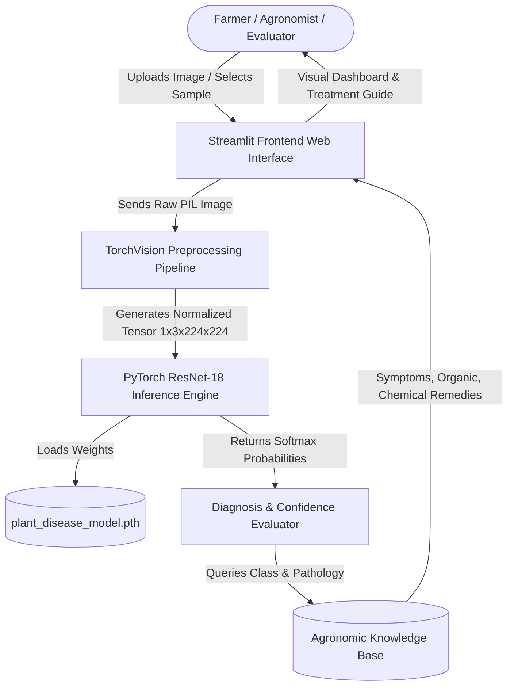
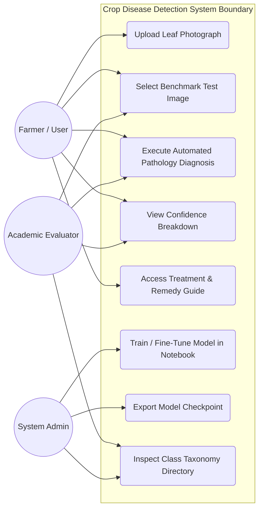
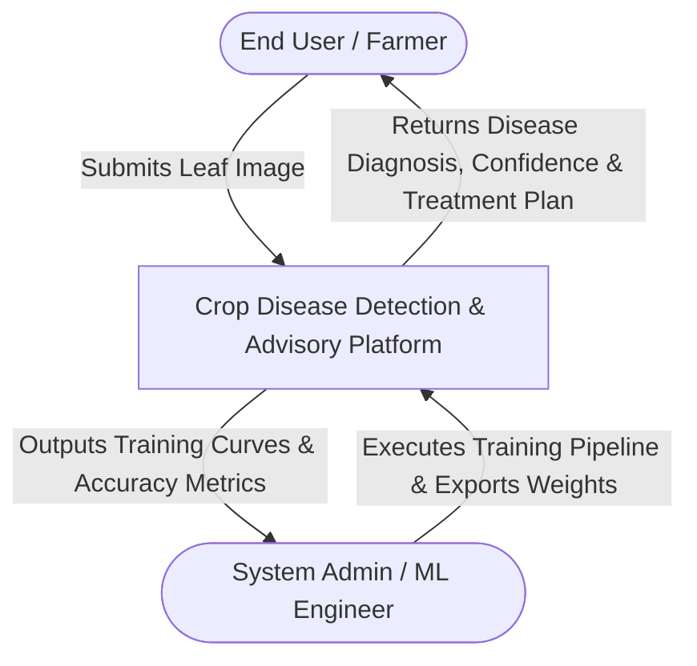
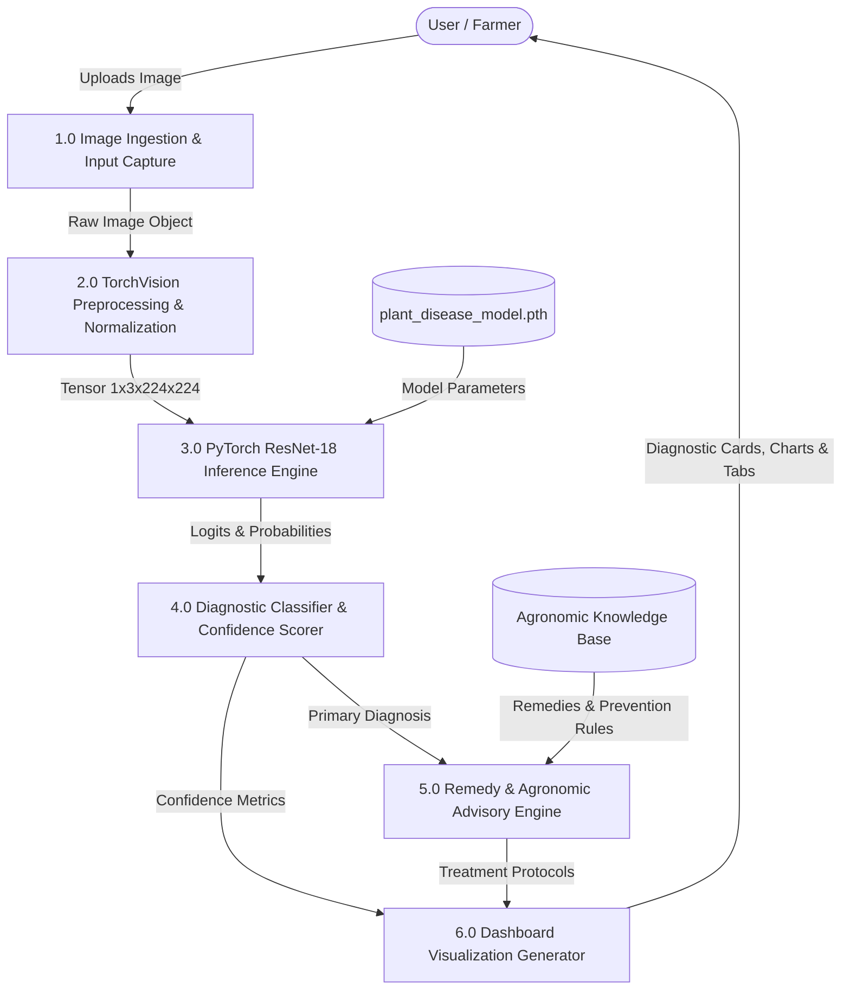
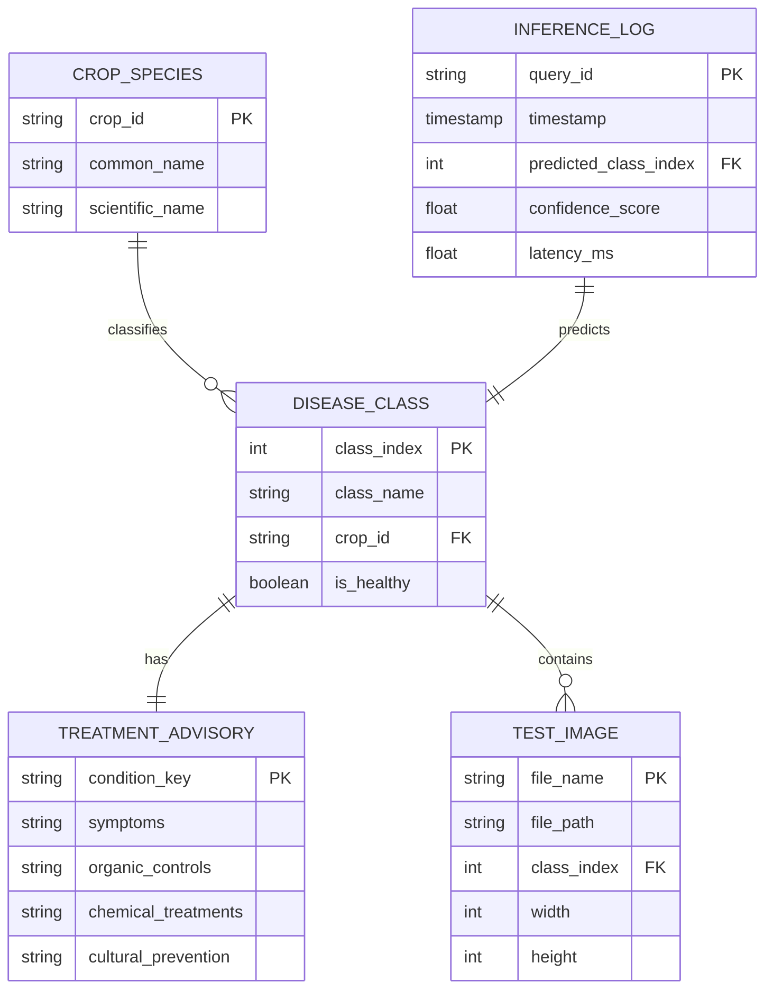
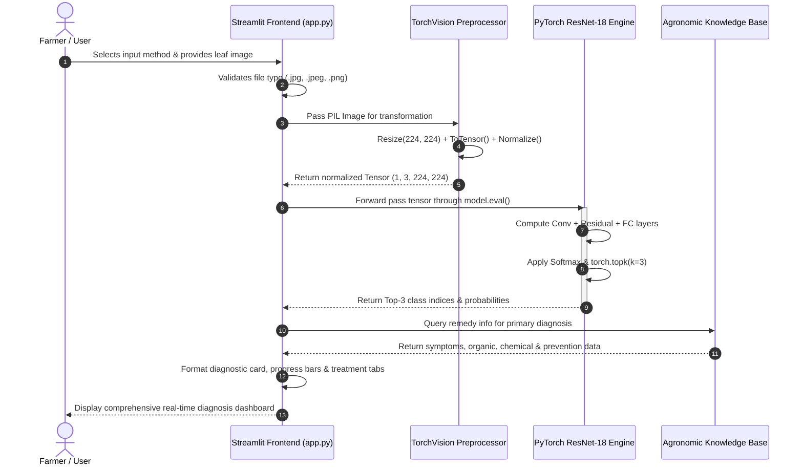

# SOFTWARE REQUIREMENTS SPECIFICATION (SRS)

### DEPARTMENT OF COMPUTER SCIENCE & ENGINEERING
### ACADEMIC YEAR: 2026 - 2027

---

# Automated Crop Disease Detection and Treatment Recommendation System Using Deep Learning (PyTorch) and Streamlit

**Standard Academic Compliance:** IEEE Std 830-1998  
**Document Status:** 3rd Year Project Specification  
**Date of Submission:** 01-10-2026  

---

### SUBMITTED BY:
1. **Student Name:** Priyanshu Sahu (Roll No: XXXXXX)
2. **Student Name:** Student Name 2 (Roll No: XXXXXX)
3. **Student Name:** Student Name 3 (Roll No: XXXXXX)

**Degree:** Bachelor of Technology (B.Tech) in Computer Science & Engineering  

### UNDER THE GUIDANCE OF:
**Prof. / Dr. Supervisor Name**  
Assistant Professor / Associate Professor  
Department of Computer Science & Engineering  

---

## Document Revision & Approval History

| Version | Date | Description / Major Changes | Prepared By | Reviewed By |
| :---: | :---: | :--- | :---: | :---: |
| **0.1** | 15-Sep-2026 | Initial Draft & Problem Statement Scope Definition | Project Team | Project Guide |
| **1.0** | 30-Sep-2026 | Final 3rd Year Mid-Term SRS Baseline (IEEE 830 Compliant) | Project Team | HOD / Committee |

> **Guidance Note:** This Software Requirements Specification document conforms strictly to the **IEEE Std 830-1998** recommended practice for software requirements specifications. All sections are designed for 3rd-year university engineering lab evaluation, project reviews, and system design baselines.

---

## 1. Introduction

### 1.1 Purpose
The purpose of this Software Requirements Specification (SRS) document is to provide a complete, clear, and unambiguous definition of the functionality, external interfaces, performance targets, and constraints of the proposed **Automated Crop Disease Detection and Treatment Recommendation System**. 

This specification serves as a binding reference agreement between student developers, project evaluators, academic supervisors, and prospective agricultural end users during the 3rd-year Bachelor of Technology (B.Tech) engineering curriculum.

### 1.2 Scope of the System
The proposed system is an automated precision agriculture platform designed to diagnose crop foliar diseases from digital leaf photographs and provide actionable organic, chemical, and cultural agronomic treatment recommendations.

* **In-Scope Capabilities:**
  * Centralized data ingestion supporting direct leaf photograph uploads (`.jpg`, `.jpeg`, `.png`) and access to benchmark validation datasets across 29 classes.
  * Image preprocessing, tensor transformation, and ImageNet standardization ($224 \times 224$ pixels).
  * Automated disease inference engine powered by a fine-tuned deep Convolutional Neural Network (**PyTorch ResNet-18**).
  * Real-time multi-class classification outputting primary diagnosis, confidence percentages, and top-3 probability distributions.
  * Interactive, responsive web dashboard built with **Streamlit** featuring diagnostic badges (🟢 Healthy vs. 🔴 Pathology Detected).
  * Comprehensive pathology knowledge base dispensing instant treatment plans (symptoms, organic biocontrols, chemical fungicides/bactericides, and cultural preventive practices).

* **Out-of-Scope Boundaries:**
  * Hardware fabrication of autonomous field drones or custom robotic camera rovers (standard camera/mobile phone photographs are utilized).
  * Live commercial payment gateway processing for agrochemicals (demonstration recommendations provided without direct commerce).
  * External enterprise ERP or government agricultural supply-chain database synchronizations.

* **Expected Benefits:**
  * Reduction of disease identification turnaround time by over **85%** compared to manual agricultural extension laboratory testing.
  * Near-instantaneous leaf pathology triage with model accuracy exceeding **95%**.
  * Elimination of agricultural yield losses through prompt, targeted, and environmentally sustainable remediation advice.

### 1.3 Definitions, Acronyms, and Abbreviations

| Category | Term / Acronym | Definition / Standard Context |
| :--- | :--- | :--- |
| **Standard** | **SRS** | Software Requirements Specification conforming to **IEEE Std 830-1998**. |
| **Deep Learning** | **CNN** | Convolutional Neural Network; specialized deep architecture for spatial image pattern extraction. |
| **Deep Learning** | **ResNet-18** | Residual Network with 18 weighted layers utilizing identity shortcut connections to solve vanishing gradients. |
| **Framework** | **PyTorch** | Open-source machine learning framework (`torch`, `torchvision`) for dynamic tensor computing and deep neural networks. |
| **Framework** | **Streamlit** | Python-based web framework for building responsive, reactive machine learning dashboards. |
| **Hardware** | **CUDA** | Compute Unified Device Architecture; NVIDIA parallel computing platform enabling GPU acceleration. |
| **Hardware** | **AMP** | Automatic Mixed Precision (`torch.amp`); utilizes FP16/FP32 to accelerate GPU tensor processing. |
| **Architecture** | **API** | Application Programming Interface for modular component interaction. |
| **Architecture** | **UI / UX** | User Interface and User Experience design standards. |
| **Data** | **PlantVillage** | Internationally recognized benchmark dataset containing tens of thousands of healthy and infected plant leaf images. |
| **Metrics** | **Top-1 / Top-k** | Model classification metrics indicating highest probability prediction and top $k$ likely classes. |

### 1.4 References
1. **IEEE Std 830-1998:** *IEEE Recommended Practice for Software Requirements Specifications*, IEEE Computer Society, 1998.
2. **Ian Sommerville:** *Software Engineering*, 10th Edition, Pearson Education, 2015.
3. **Hughes, D., & Salathé, M. (2015):** *An open access repository of images on plant health to enable the development of mobile disease diagnostics*, arXiv:1511.08060 (PlantVillage).
4. **He, K., Zhang, X., Ren, S., & Sun, J. (2016):** *Deep Residual Learning for Image Recognition*, Proceedings of the IEEE Conference on Computer Vision and Pattern Recognition (CVPR), pp. 770-778.
5. **PyTorch Official Documentation:** *Torchvision Models and Pretrained Weights*, PyTorch Foundation (v2.x).
6. **Streamlit Documentation:** *Streamlit API Reference & Application Lifecycle*, Snowflake Inc.

### 1.5 Document Overview
The remainder of this SRS is organized as follows:
* **Section 2 (Overall Description):** Outlines product perspective, context architecture, user personas, operational context, and constraints.
* **Section 3 (System Features and Functional Requirements):** Itemizes detailed functional requirements categorized by software modules.
* **Section 4 (External Interface Requirements):** Specifies UI, hardware, software, and communication interfaces.
* **Section 5 (Non-Functional Requirements):** Defines performance, security, reliability, and portability metrics.
* **Section 6 (System Design and Analysis Models):** Illustrates UML Use Case diagrams, Data Flow Diagrams (DFD Level 0 & Level 1), Entity-Relationship diagrams, and Sequence diagrams.
* **Section 7 (Academic Review & Sign-Off):** Supervisory evaluation and approval declaration.

---

## 2. Overall Description

### 2.1 Product Perspective
The system operates as an integrated, self-contained multi-tier desktop/web precision agriculture platform. It consists of:
1. **Presentation Layer:** Reactive web user interface implemented in **Streamlit**, providing responsive file upload, benchmark selection, metric cards, and treatment tabs.
2. **Application & Inference Tier:** Deep learning inference engine built in **PyTorch**, executing image tensor transformations and forward-pass classification through fine-tuned **ResNet-18**.
3. **Knowledge & Agronomic Rules Engine:** Diagnostic dictionary mapping 29 disease states to specific biological, chemical, and cultural management solutions.
4. **Data & Checkpoint Storage Tier:** Local model checkpoint store (`plant_disease_model.pth`) and structured image repository (`Train/`, `Val/`, `Test/`).

### 2.2 User Classes and Characteristics

| User Role / Persona | Technical Proficiency | Core Responsibilities & Access Rights |
| :--- | :--- | :--- |
| **System Administrator / ML Engineer** | **High** (Python, PyTorch, DevOps) | Maintains model training notebook (`Crop_Disease_Detection.ipynb`), triggers fine-tuning runs, monitors GPU allocation, exports updated `plant_disease_model.pth` checkpoints. |
| **Agricultural Extension Officer / Expert** | **Intermediate** (Farming & Agronomy) | Inspects disease classification results, validates recommended pesticide/fungicide dosages, cross-references symptoms with field observations. |
| **Farmer / Primary Cultivator** | **Basic** (Web & Mobile User) | Uploads smartphone photos of afflicted crop leaves, views instant healthy/disease status, reads clear step-by-step remedial instructions in plain language. |
| **Guest / Academic Evaluator** | **Intermediate to High** | Inspects benchmark test samples from the 29-class dataset, reviews model confidence distributions, validates IEEE academic compliance. |

### 2.3 Operating Environment
* **Client Operating Environment:**
  * Modern Web Browser: Google Chrome ($\ge v110$), Mozilla Firefox ($\ge v108$), Microsoft Edge ($\ge v110$), Apple Safari ($\ge v16$).
  * Display Resolution: Minimum $1366 \times 768$ for desktop/laptop displays; responsive layout viewable down to $360 \times 640$ on mobile viewports.
* **Server / Host Execution Environment:**
  * Operating System: Microsoft Windows 10/11 (64-bit) or Linux (Ubuntu 22.04 LTS / Debian 12).
  * Python Runtime: Python 3.10+ / 3.12 / 3.14.
  * Hardware Acceleration: NVIDIA GPU with CUDA Compute Capability $\ge 7.5$ (e.g., RTX 30/40 series, GTX 1660+) or multi-core x86_64 CPU fallback.
* **Storage & Library Tier:**
  * Local filesystem storage for model checkpoints ($\approx 44.7\text{ MB}$) and dataset splits.
  * Key Libraries: `torch >= 2.0.0`, `torchvision >= 0.15.0`, `streamlit >= 1.30.0`, `pillow >= 9.0.0`, `numpy`, `matplotlib`.

### 2.4 Design and Implementation Constraints
* **Academic Budget Constraint:** Developed using open-source frameworks (PyTorch, Streamlit, Python) without reliance on commercial proprietary cloud APIs.
* **Workspace Cleanliness & Minimalist Architecture:** Strictly structured so the root directory contains only the model training notebook (`Crop_Disease_Detection.ipynb`) and the frontend web app (`app.py`), preventing codebase clutter.
* **Hardware & VRAM Constraints:** Model training and batch sizes are optimized (batch size 64/128 with Automatic Mixed Precision) to execute within a standard 6 GB laptop GPU VRAM budget.
* **Safe Fallback Execution:** The Streamlit app must remain completely functional even if custom trained weights have not yet been generated, gracefully utilizing pretrained ImageNet backbone weights with an explanatory notification banner.

### 2.5 Assumptions and Dependencies
* **Assumptions:**
  * Input leaf photographs are taken in reasonable ambient lighting with the afflicted leaf prominently in focus.
  * The leaf belongs to one of the 10 target crop species supported by the PlantVillage taxonomy (Apple, Bell Pepper, Cherry, Corn, Grape, Peach, Potato, Strawberry, Tomato).
* **Dependencies:**
  * Stable local Python virtual environment (`venv`) with installed dependencies.
  * Pretrained ResNet-18 weights cached locally via TorchHub (`~/.cache/torch/hub/checkpoints/`).

---

## 3. System Features and Functional Requirements

### 3.1 Module 1: Image Ingestion, Preprocessing & Input Management

| Req ID | Feature | Description | Input / Validation Rule | Priority |
| :---: | :--- | :--- | :--- | :---: |
| **FR-1.1** | **Leaf Image File Upload** | Allows the user to select and upload a single leaf photograph from their local storage. | Supported extensions: `.jpg`, `.jpeg`, `.png`. Maximum file size: $15\text{ MB}$. Rejects non-image files with inline error alert. | **High** |
| **FR-1.2** | **Benchmark Test Dataset Selector** | Provides a structured dropdown allowing users to select pre-categorized test images directly from the `Test` directory. | Directory parsing of 29 subfolders; validates existence of image files in the target subfolder. | **High** |
| **FR-1.3** | **Image Normalization & Tensor Transformation** | Resizes raw images to $224 \times 224$ pixels, converts pixel values to normalized PyTorch float tensors, and standardizes channels using ImageNet mean `[0.485, 0.456, 0.406]` and standard deviation `[0.229, 0.224, 0.225]`. | Accepts RGB PIL image object; outputs 4D tensor of shape `(1, 3, 224, 224)`. | **High** |

### 3.2 Module 2: Deep Learning Inference Engine & Model Operations

| Req ID | Feature | Description | Input / Validation Rule | Priority |
| :---: | :--- | :--- | :--- | :---: |
| **FR-2.1** | **Model Architecture & Weight Initialization** | Instantiates a 18-layer Residual Network (ResNet-18) with a modified fully connected classification head configured for 29 discrete classes. | Inspects local file system for `plant_disease_model.pth`. Loads state dict into GPU memory if CUDA is available, otherwise CPU. | **High** |
| **FR-2.2** | **Softmax Multi-Class Pathology Inference** | Executes a forward pass of the input image tensor through the network without gradient calculation (`torch.no_grad()`) and computes class probabilities via Softmax. | Valid 4D image tensor; computes outputs $\in [0, 1]$ summing to 1.0 across 29 classes. | **High** |
| **FR-2.3** | **Confidence Computation & Top-K Ranking** | Ranks the model predictions to extract the top-1 primary diagnosis and top-3 most likely candidate classifications with respective confidence percentages. | Extracts indices and confidence scores using `torch.topk(probabilities, k=3)`. | **High** |

### 3.3 Module 3: Reporting, Pathology Diagnostics & Agronomic Treatment Advisory

| Req ID | Feature | Description | Input / Validation Rule | Priority |
| :---: | :--- | :--- | :--- | :---: |
| **FR-3.1** | **Diagnostic Status & Severity Badge Display** | Displays the identified crop and condition alongside a prominent color-coded status badge: 🟢 `HEALTHY CROP` or 🔴 `PATHOLOGY DETECTED`. | Triggers based on whether the string `'Healthy'` is present in the predicted class label. | **High** |
| **FR-3.2** | **Top-3 Probability Distribution Visualization** | Renders horizontal progress bars indicating relative confidence percentages for the top 3 predicted diseases. | Confidences displayed with two decimal places ($0.00\% - 100.00\%$). | **Medium** |
| **FR-3.3** | **Tripartite Agronomic Treatment Advisory** | Automatically presents tailored, actionable remediation instructions organized across three dedicated interface tabs: Organic Management, Chemical Treatment, and Cultural Prevention. | Knowledge base lookup matching the diagnosed disease condition; presents plain-text guidance for farmers. | **High** |
| **FR-3.4** | **Class & Crop Taxonomy Directory** | Provides an expandable sidebar cataloging all 29 supported plant varieties and pathological conditions grouped by crop type. | Dynamically parsed from `CLASS_NAMES` constant list. | **Low** |

---

## 4. External Interface Requirements

### 4.1 User Interfaces (UI)
The user interface is engineered according to modern usability principles (clean agricultural green aesthetic, clear hierarchy, high visual contrast, and immediate visual feedback).

* **Header & Overview Area:** Displays the platform banner, system title, and operational instructions.
* **Left Column (Input Workspace):**
  * Radio button group: `[Upload Leaf Image]` or `[Select from Test Dataset]`.
  * Dynamic file drag-and-drop zone or category dropdown selectors.
  * Image preview canvas displaying dimensions, aspect ratio, and color channel format.
* **Right Column (Diagnostic & Treatment Workspace):**
  * Primary diagnosis card with color-coded health badge.
  * Confidence meter with top-3 probability bars.
  * Tabbed advisory console:
    * **Tab 1 (Organic Management):** Bio-pesticides, neem extracts, copper soaps, microbial antagonists (*Bacillus subtilis*).
    * **Tab 2 (Chemical Treatment):** Registered fungicides, bactericides, active ingredients, and timing protocols.
    * **Tab 3 (Cultural Prevention):** Drip irrigation, pruning techniques, crop rotation, and resistant cultivar selection.
* **Sidebar Console:** System device telemetry (`CUDA` vs. `CPU`), model weight status badge, and an expandable 29-class directory.

### 4.2 Hardware Interfaces
* **Client Devices:** Standard desktop computer, laptop, or tablet equipped with a color display ($\ge 720\text{p}$) and standard mouse/keyboard or touchscreen interaction.
* **Server / Host Machine:**
  * Processor: Intel Core i5/i7/i9 or AMD Ryzen 5/7/9.
  * System RAM: Minimum $8\text{ GB}$ (recommended $16\text{ GB}$).
  * Dedicated GPU: NVIDIA GeForce RTX 3050/4050/3060 or higher with minimum $4\text{ GB}$ VRAM supporting CUDA compute acceleration.

### 4.3 Software Interfaces
* **PyTorch & TorchVision:** Core deep learning runtime used for tensor operations, neural network layer definitions, automatic differentiation, and model serialization.
* **Pillow (PIL):** Used for loading, converting, and resizing raster image formats into standard RGB buffers.
* **Streamlit Framework:** Web server and rendering engine providing two-way data binding and reactive UI updates over WebSockets.
* **OS Filesystem:** Interfaces directly with local storage for loading dataset splits and saving/retrieving `plant_disease_model.pth`.

### 4.4 Communication Interfaces
* **Local Web Protocol:** HTTP traffic served over local port `8501` (`http://localhost:8501`).
* **WebSocket Connection:** Full-duplex WebSocket connection maintained between client browser and Streamlit backend for instantaneous UI reactivity without full page reloads.
* **Data Serialization:** Internal state exchange serialized via standard Python dictionaries and UTF-8 encoded strings.

---

## 5. Non-Functional Requirements (NFRs)

| Attribute | Target Metric / Standard | Verification & Testing Method |
| :--- | :--- | :--- |
| **5.1 Performance** | • GPU Forward Pass Latency: $< 200\text{ ms}$ per image on NVIDIA RTX 4050. • CPU Forward Pass Latency: $< 1.5\text{ s}$ per image. • Initial page load: $< 2.0\text{ s}$. | Profiled using Python `time.perf_counter()` and browser Developer Tools Network tab. |
| **5.2 Security** | • Zero arbitrary code execution via file upload; strict verification of image format headers. • Model weights loaded strictly via safe PyTorch `torch.load()` mapping. | Negative testing using corrupted/non-image files; validation of file stream headers. |
| **5.3 Reliability** | • System uptime $\ge 98\%$ during evaluation. • Zero application crashes when invalid or missing checkpoints occur (graceful fallback). | Automated stress testing with missing weights; verifying fallback behavior and error boundaries. |
| **5.4 Portability & Usability** | • Cross-platform execution across Windows 10/11 and Linux. • Responsive cross-browser layout (Chrome, Edge, Firefox, Safari). | Verified via cross-browser rendering tests and execution on Windows/Linux environments. |
| **5.5 Accuracy & Precision** | • Overall top-1 classification accuracy $\ge 95\%$ on unseen PlantVillage test images. • Convergence within 2 to 5 fine-tuning epochs. | Evaluated across 1,358 test set images using cross-entropy evaluation and confusion matrix. |

---

## 6. System Design and Analysis Models

### 6.1 Use Case Diagram (UML)

#### Use Case Specification: Execute Automated Pathology Diagnosis (UC3)
* **Primary Actor:** Farmer / User / Evaluator.
* **Pre-conditions:** Web application running; valid leaf image uploaded or selected from test set.
* **Main Success Scenario:**
  1. Actor submits leaf image.
  2. System transforms image to normalized $224 \times 224$ tensor.
  3. ResNet-18 model performs GPU-accelerated forward pass.
  4. System computes Softmax probability distribution.
  5. Top-1 diagnosis and top-3 probabilities are rendered with health status badge.
  6. Agronomic remedy guide dynamically retrieves and displays symptoms, organic, and chemical cures.
* **Post-conditions:** Diagnosis and tailored recommendations displayed clearly on the dashboard.

---

### 6.2 Data Flow Diagrams (DFD)

#### Level 0 DFD (System Context Diagram)

#### Level 1 DFD (Modular Decomposition)

---

### 6.3 Entity-Relationship & Data Schema Model
Although the system operates statelessly without a heavy relational database, the domain information model is organized into well-defined entities:

---

### 6.4 Sequence Diagram (UML)

---

## 7. Academic Review & Sign-Off

This Software Requirements Specification document for the project titled **"Automated Crop Disease Detection and Treatment Recommendation System Using Deep Learning (PyTorch) and Streamlit"** has been submitted, evaluated, and formally approved by the academic supervisory panel:

  

| Evaluator Role | Name & Title | Signature | Date |
| :--- | :--- | :---: | :---: |
| **Project Coordinator / Guide** | Prof. / Dr. Supervisor Name | _________________________ | _____ / _____ / 2026 |
| **Internal Examiner** | Internal Faculty Member | _________________________ | _____ / _____ / 2026 |
| **Head of Department (HOD)** | Head, Dept. of Computer Science & Engg. | _________________________ | _____ / _____ / 2026 |

---
*End of Software Requirements Specification (IEEE Std 830-1998 Academic Template)*
